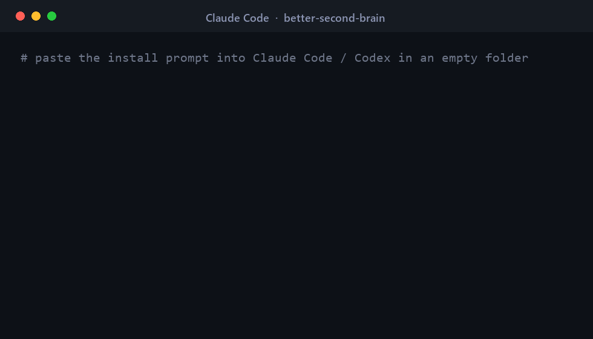

# Better Second Brain (BSB)

<p align="center">
  <a href="https://github.com/maystudios/better-second-brain/stargazers"></a>
  <a href="https://github.com/maystudios/better-second-brain/network/members"></a>
  <a href="https://github.com/maystudios/better-second-brain/issues"></a>
  <a href="https://github.com/maystudios/better-second-brain/commits/main"></a>
  <a href="./LICENSE"></a>
  
  
  
  <a href="./benchmark/RESULTS.md"></a>
</p>

<p align="center">
  
</p>

> An LLM-maintained knowledge base built on Andrej Karpathy's **LLM Wiki** pattern — and measurably *better*.
> Karpathy's pattern compiles your sources into a persistent, interlinked wiki instead of re-deriving answers
> from raw chunks on every query (RAG). **BSB keeps that, then adds three layers that close the gaps the original
> pattern leaves open:** an automatic knowledge **graph**, a self-**improvement** loop, and autonomous
> self-**healing**.

BSB is an open-source template. Clone it, point it at your sources, and an LLM agent (Claude Code, Codex,
OpenCode, …) maintains a trustworthy, browsable, version-controlled knowledge base for you. Ships configured for
**software / tech reference**, but works for any domain — change one config block.

---

## ⚡ Install — paste this into your agent

Open an **empty folder** in Claude Code, Codex, or any coding agent and paste the prompt below. It clones BSB into
that folder and stands up a brand-new brain for *your* topic — nothing else to set up:

```text
Set up a "Better Second Brain" (BSB) in the CURRENT folder, following these steps exactly:

1. Clone the template into this folder:
   git clone https://github.com/maystudios/better-second-brain .
   (If this folder is NOT empty, instead run:
    git clone https://github.com/maystudios/better-second-brain bsb && cd bsb)
2. Read CLAUDE.md — that file is now your operating schema; follow it for everything below.
3. Ask me for my DOMAIN (what this brain is about) and a one-line LITMUS test, then initialize a fresh, empty brain:
   python scripts/init_brain.py --domain "<MY DOMAIN>" --litmus "<MY LITMUS>" --fresh --yes
4. Verify it is clean:
   python scripts/verify_wikilinks.py   and   python scripts/lint_sources.py --summary
5. Tell me the brain is ready and ask for my first source (a URL or file) to ingest into raw/.

You are now the maintainer of this brain. Never write a wiki page from your own memory — every page must be
grounded in at least 3 real, fetched sources (CLAUDE.md §1.5), and populate pages "lean" (§2.1). I curate the
sources and ask the questions; you read, verify, summarize, file, and cross-reference.
```

**Already cloned it?** Run the shipped slash command **`/bsb-init`** in Claude Code, or
`python scripts/init_brain.py --domain "…" --litmus "…" --fresh --yes`. Then open the folder as a vault in
**Obsidian** (the human reader) next to your agent. Manual / Obsidian-first setup: [`docs/install.md`](./docs/install.md).

---

## Why this exists

The LLM Wiki pattern (Karpathy, April 2026 — [X post](https://x.com/karpathy/status/2039805659525644595),
[gist](https://gist.github.com/karpathy/442a6bf555914893e9891c11519de94f)) is brilliant but deliberately minimal.
In practice it has three soft spots. BSB targets each one:

| The gap in vanilla LLM-Wiki | BSB's answer |
|---|---|
| **You only find connections you think to ask about.** Cross-links are manual. | **graphify** builds a real knowledge graph over `raw/`+`wiki/` — community detection, hub ("god") nodes, *surprising connections*, GraphRAG queries — and feeds what it finds back into the lint loop. |
| **The method never improves itself.** The schema is static; quality drifts. | **auto-research** periodically re-researches PKM/LLM-wiki best practices and proposes verified upgrades to the schema and page formats. The brain's *method* compounds, not just its data. |
| **Pages rot. A wrong/outdated doc just sits there.** | **Self-healing**: because every page cites its sources, the brain re-verifies itself, detects superseded versions / dead links / unsupported claims, and fixes them — report-only, on-approval, or autonomously per area. |

Plus a **research-discipline gate** the original lacks: *no page may be written from the model's memory* — every
page must be grounded in ≥ 3 fetched primary sources, or it isn't written. That single rule is what makes the
result trustworthy instead of plausible-sounding slop.

---

## Architecture

Three layers (Karpathy) + a temporal triad of control files:

```
raw/      immutable sources you curate   (the LLM only reads)
wiki/     interlinked markdown pages      (the LLM owns + maintains)
          ├ sources/ concepts/ entities/ cheatsheets/ syntheses/ moc/
index.md  what exists   ·  log.md  what happened  ·  roadmap.md  what's next
CLAUDE.md the schema/rulebook the agent follows   (AGENTS.md = same, for Codex/OpenCode)
```

Six operations the agent runs: **Ingest · Query · Lint** (classic) + **Graph · Improve · Heal** (the "better" part).
Full spec: [`CLAUDE.md`](./CLAUDE.md).

---

## Quickstart

Requires **Python ≥ 3.10** (for the helper scripts) and git. Obsidian and graphify are optional.

```bash
git clone https://github.com/maystudios/better-second-brain "Second Brain" && cd "Second Brain"
# Open the folder as a vault in Obsidian (optional but recommended — it's the human reader).
# Open the folder in Claude Code (or Codex/OpenCode) — the agent reads CLAUDE.md automatically.
```

Then, in the agent:

1. **Make it yours** — edit the `DOMAIN` / `LITMUS` block in [`CLAUDE.md`](./CLAUDE.md) §0 and
   [`bsb.config.md`](./bsb.config.md). (Skip to use the shipped software/PKM domain.)
2. **Add a source** — drop a file in `raw/`, or say *"ingest https://…"*. The agent fetches it, writes a source
   page, updates the affected wiki pages, and logs it.
3. **Ask** — *"what does the wiki say about X?"* The agent reads `index.md`, the relevant pages, and answers with
   citations — then offers to file good answers back as new pages.
4. **Keep it healthy** — say *"lint"* periodically. Add the optional layers when you want them (below).

Full setup, including the optional layers and git hooks: [`docs/install.md`](./docs/install.md).

## The optional layers (off by default, degrade gracefully)

- **graphify** — `uv tool install graphifyy`, then the agent uses the `/graphify` skill. → [`docs/graphify-integration.md`](./docs/graphify-integration.md)
- **auto-research** — a Claude Code skill that self-improves the schema. → [`docs/auto-research-integration.md`](./docs/auto-research-integration.md)
- **self-healing** — runs on the source-grade lint. → [`docs/self-healing.md`](./docs/self-healing.md)
- **qmd** — local hybrid search when you outgrow `index.md`. → `github.com/tobi/qmd`

## 📊 Is it actually better? (measured, not asserted)

BSB ships a benchmark and **runs it**: the same fetched sources built two/three ways — a vanilla Karpathy wiki vs.
BSB — answered against a gold question set, scored by an objective judge, with deterministic token accounting
(`scripts/token_report.py`). Three runs so far (`uv`, `MCP`, `Ruff`). **Full data + caveats:
[`benchmark/RESULTS.md`](./benchmark/RESULTS.md)** · method & how to run your own: [`docs/benchmark.md`](./docs/benchmark.md).

> **Strongest evidence — applied to a *real, pre-existing* 368-page second brain** (a hand-built game-dev wiki, in a
> domain BSB knew nothing about): the graph layer answered the same questions at **−23% real tokens / −56%
> read-footprint**, at equal quality. → [`benchmark/REAL-BRAIN.md`](./benchmark/REAL-BRAIN.md).

**Headline — large run (Ruff, 15 sources, 14 questions, exact `tiktoken` counts):**

| Arm | Quality /6 | Fill tokens | Links / 1k | Read / query | vs. raw |
|---|:--:|--:|:--:|--:|:--:|
| vanilla Karpathy | 5.64 | 7,485 | 12.0 | 1,296 | 6.1× |
| BSB (full) | **5.93** | 22,366 | 20.8 | 1,042 | 7.6× |
| **BSB-lean** | **5.93** | **7,648** | **31.0** | **442** | **17.9×** |

- **Quality:** BSB beats a vanilla wiki by **+5–12%** across runs — the margin is **verifiable citation** (BSB cites
  exact source URLs; vanilla cites bare filenames), not raw correctness.
- **Reading is cheap and scales:** answering one query costs **2–18× fewer tokens** than reading the raw sources
  (`bsb-lean` hit 17.9× on the large corpus).
- **Filling is cheap too:** the **`bsb-lean`** fill mode matches full-BSB quality at **−66% fill tokens** (≈ a vanilla
  wiki's cost) with the *densest* interconnection — so grounding + traceability cost essentially nothing extra. It's
  the default ([`CLAUDE.md`](./CLAUDE.md) §2.1).
- **Honest caveats:** small N (3 topics / 30 Q), not fully blinded, well-documented topics flatter the memory-only
  arm; the "edge grows with corpus size" idea did *not* hold. A private/novel corpus is the next test.

## Star history

<p align="center">
  <a href="https://star-history.com/#maystudios/better-second-brain&Date">
    
  </a>
</p>

If BSB is useful to you, a ⭐ helps other people find it.

## Credit & license

Built on Andrej Karpathy's LLM Wiki pattern. Graph layer by [graphify](https://github.com/safishamsi/graphify).
Retrieval layer by [qmd](https://github.com/tobi/qmd). MIT licensed — see [`LICENSE`](./LICENSE).
